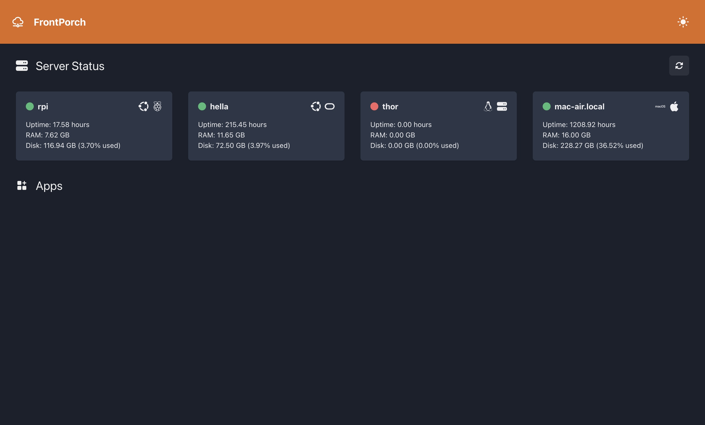
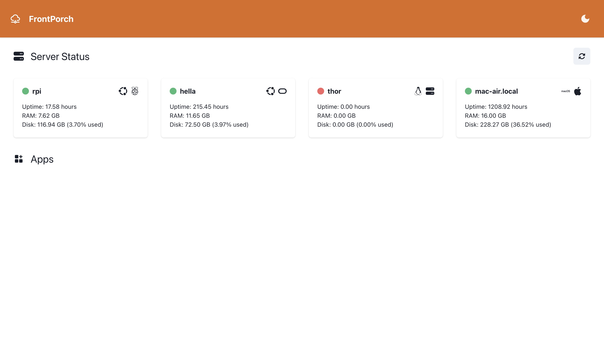

# FrontPorch

FrontPorch is a configurable dashboard designed for homelabs. It provides a comprehensive view of your server status, Docker-related information, and configurable links and widgets through a YAML file.

## Goals

- Have basic monitoring for all of the servers included in my homelab setup without the need to setup a full blown monitoring stack
- Add links for frequently accessed services
- Add some useful interactive apps

## Features

- **Server Status:** Monitor the status of your servers, including uptime, RAM usage, and disk usage.
- **Docker Integration:** Display Docker-related information if Docker is installed on your system.
- **Configurable Dashboard:** Customize links and widgets through a YAML configuration file.
- **Dark and Light Mode:** Switch between dark and light mode for better readability.

## Screenshots

### Dark Mode

### Light Mode

## Contributing

Contributions are welcome! Please fork the repository and create a pull request.

## License

This project is licensed under the MIT License. See the [LICENSE](LICENSE) file for details.

## Contact

For any questions or suggestions, feel free to open an issue!
